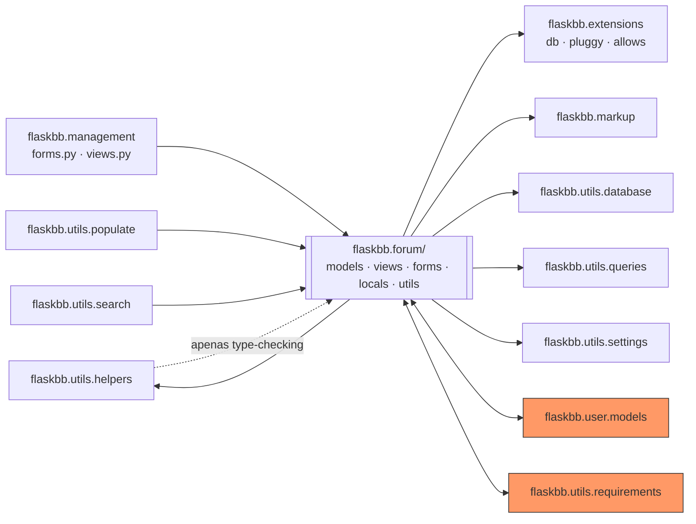

# Análise do `flaskbb/forum/` como Sistema Legado — Tarefa 3.2

## Dependências internas e externas

**O que `forum/` importa:** `flaskbb.extensions` (`db`, `pluggy`, `allows`), `flaskbb.markup`, `flaskbb.utils.database`, `flaskbb.utils.helpers`, `flaskbb.utils.queries`, `flaskbb.utils.settings`, `flaskbb.utils.requirements` (para as classes de permissão como `IsAtleastModeratorInForum`), e `flaskbb.user.models.User`.

**Quem importa `forum/`:** `flaskbb.user.models` (`Forum`, `Post`, `Topic`, `topictracker`), `flaskbb.management.{forms,views}` (`Category`, `Forum`, `Post`, `Report`, `Topic`, `UserSearchForm`), `flaskbb.utils.populate`, `flaskbb.utils.requirements` (`current_forum`, `current_post`, `current_topic`, `Forum`, `Post`, `Topic`), `flaskbb.utils.search`, e `flaskbb.utils.helpers` — mas esse último só sob `if TYPE_CHECKING:`, ou seja, é uma dependência de tipagem estática, não de execução.



As duas caixas laranjas (`user.models` e `utils.requirements`) são dependências **de mão dupla** — ver a seção de acoplamento abaixo.

## Acoplamento e coesão

### Alto acoplamento #1 — ciclo de importação entre `forum/` e `user/`

`flaskbb/forum/models.py:27` e `flaskbb/forum/forms.py:27` importam `User` de `flaskbb.user.models`. Ao mesmo tempo, `flaskbb/user/models.py:31` importa `Forum, Post, Topic, topictracker` de `flaskbb.forum.models`. Ou seja: os dois módulos mais centrais do domínio (usuário e fórum) **dependem um do outro em tempo de importação**. Isso só "funciona" hoje por causa da ordem em que o Python resolve os imports na inicialização da aplicação — é o tipo de coisa que quebra de forma confusa (um `ImportError`/`AttributeError` no meio da inicialização) se alguém reordenar imports ou tentar extrair um dos dois módulos para um pacote separado, o que é justamente o que a Tarefa 3.3 vai considerar como uma das opções de evolução.

### Alto acoplamento #2 — inversão de camada com `utils/`

`flaskbb/utils/requirements.py` (as classes de permissão usadas por toda a aplicação, não só pelo fórum) importa diretamente `current_forum`, `current_post`, `current_topic` de `flaskbb.forum.locals` e `Forum, Post, Topic` de `flaskbb.forum.models` — e `forum/views.py` importa de volta essas mesmas classes de permissão de `utils/requirements.py`. Um pacote chamado "utils" deveria ser a camada mais genérica e reutilizável da aplicação (a que os módulos de domínio dependem), não o contrário. Aqui a dependência foi invertida: a "camada utilitária" depende de conceitos específicos do domínio do fórum. Isso significa que qualquer mudança na estrutura de `forum/locals.py`/`forum/models.py` arrisca quebrar silenciosamente o sistema de permissões inteiro, não só o fórum.

### Baixa coesão — `forum/views.py` mistura responsabilidades que não são todas "fórum"

O arquivo concentra views de: navegação e CRUD de tópicos/posts (claramente fórum), moderação em massa (fórum), **listagem de membros** (`MemberList`, mais próxima do domínio de `user/` do que do de `forum/`), **busca geral** do site (`Search`, uma funcionalidade transversal, não específica de fórum), e **preview de markdown** (`MarkdownPreview`, um utilitário genérico de renderização de texto que não tem nenhuma relação com tópicos/posts — poderia igualmente servir para qualquer campo de texto rico da aplicação). O critério de agrupamento do arquivo parece ter sido "é uma rota HTTP que existe no fórum", não "resolve o mesmo problema de domínio" — por isso o arquivo é grande (1335 linhas) sem que todo esse tamanho venha de complexidade genuína do domínio de fórum.

## Pontos de fragilidade

1. **`flaskbb/forum/models.py:1369` — `Forum.move_topics_to()`
   descarta resultados parciais (e a docstring promete o contrário).**
   ```python
   def move_topics_to(self, topics: list[Topic]):
       """Moves a bunch a topics to the forum. Returns ``True`` if all
       topics were moved successfully to the forum.
       """
       status = False
       for topic in topics:
           status = topic.move(self)
       return status
   ```
   A própria docstring diz "retorna `True` se **todos** os tópicos foram movidos com sucesso" — mas `status` é sobrescrito a cada iteração em vez de acumulado (faltaria algo como `status = status and topic.move(self)`), então o retorno reflete só o **último** tópico da lista. Se o primeiro tópico falhar ao mover (ex.: já está no fórum de destino) mas o último tiver sucesso, o método retorna `True` — e `ManageForum.post()` mostra "Topics moved." como se tudo tivesse ido bem. Ninguém percebeu porque não há teste cobrindo mover mais de um tópico de uma vez (confirmado no `COBERTURA_FINAL.md` da Parte 1 e no `test_manage_forum.py` da Parte 2, que testa mover só 1 tópico).

2. **`flaskbb/forum/views.py` — grandes trechos de `NewPost`, `EditPost`, `Search` e `WhoIsOnline` sem nenhum teste automatizado até o fim da Parte 2.** Mesmo depois do trabalho das Partes 1 e 2, `views.py` está em 44% de cobertura — ainda a menor do módulo. Views que lidam com submissão de formulário de posts/tópicos (caminho mais usado do fórum, e o mais fácil de quebrar sem perceber numa mudança futura) continuam sem um teste automatizado sequer.

3. **O ciclo de importação `forum/` ↔ `user/`** (já descrito na seção de acoplamento) é também um ponto de fragilidade: não existe teste algum que verifique a ordem de importação continua funcionando — ela só "não quebrou ainda".

## Lei de Lehman

Puxei o histórico real de commits do repositório upstream (`jeffsantos/flaskbb`, que é um fork de `flaskbb/flaskbb`) para não especular. O projeto tem **13 anos** (primeiro commit em 2013-09-11) e `flaskbb/forum/views.py` já recebeu **310 commits** de **14 autores diferentes**. O tamanho do arquivo ao longo do tempo:

| Ano | Linhas de `views.py` |
|---|---|
| 2013 | 325 |
| 2015 | 611 |
| 2017 | 875 |
| 2019 | 1311 |
| 2021 | 1314 |
| 2024 | 1283 |
| 2026 (antes da Parte 2) | 1327 |

Isso mostra claramente a **Lei do Crescimento Contínuo/Complexidade Crescente** de Lehman até 2019 (325 → 1311 linhas, quase 4x em 6 anos) — mas também mostra o oposto depois: entre 2019 e 2024 o arquivo praticamente não muda de tamanho (1311 → 1283), e o número de commits por ano despenca (67 em 2014, contra 1 em 2019, 0 em 2020/2022/2023, 2 em 2024). É evidência direta da **Lei da Familiaridade Organizacional/Declínio de Qualidade**: o sistema não parou de crescer porque atingiu perfeição, parou porque ficou "congelado" — poucas pessoas mexendo, dívida técnica se acumulando sem ser paga. A prova mais concreta disso: o comentário `# TODO(anr): Clean this up. @_@` em cima de `ManageForum.post()` (o Long Method que catalogamos e refatoramos na Parte 2) foi introduzido no commit `c6e99f1`, em **19 de maio de 2018** — ou seja, ficou ali reconhecido como dívida técnica por **quase 8 anos**, sem que ninguém tivesse tempo/prioridade de resolver, até este projeto.

## Seams identificáveis

1. **O relógio (`time_utcnow()`), usado em todo `models.py`.** Já é um seam funcional — usamos exatamente ele no teste com dublê da Parte 1 (`tests/unit/forum/test_forum_models_mock.py`, mockando `flaskbb.forum.models.time_utcnow`) para isolar `Post.save()` do relógio real. Ponto natural pra continuar explorando: qualquer lógica futura de expiração/agendamento no fórum já tem esse seam pronto.

2. **Os eventos `pluggy.hook.flaskbb_event_post_save_*` / `flaskbb_event_topic_save_*`** (`models.py:302,308,339,857,863,896`). Esse é um seam de objeto já bem posicionado pelo time original: qualquer comportamento adicional que precise reagir a "um post foi salvo" (notificação, indexação, auditoria) pode se conectar aqui sem tocar em `models.py` — e, em teste, dá pra registrar um plugin fake no lugar de um plugin real pra verificar que o evento foi disparado com os argumentos certos, sem precisar da implementação completa de nenhum plugin de produção.