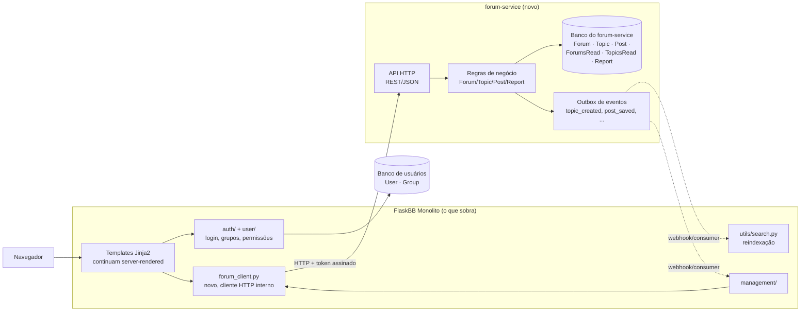

# Proposta de Evolução, Extrair `forum/` como Serviço HTTP Separado

## Motivação

A análise da Tarefa 3.2 encontrou dois problemas que uma extração de serviço ataca diretamente. Primeiro, o **ciclo de importação real** entre `forum/models.py` e `user/models.py` (`forum` importa `User`, `user` importa `Forum`/`Post`/`Topic`): hoje isso só "funciona" por acidente de ordem de import, e trava qualquer tentativa de separar fisicamente os dois módulos sem antes quebrar essa dependência circular. Segundo, a **inversão de camada** com `utils/requirements.py` (as classes de permissão do app inteiro importam diretamente `current_forum`/`Forum`/`Post`/`Topic`): extrair o fórum como serviço força a substituir esse acesso direto ao ORM por um contrato explícito (chamada HTTP ou token), o que resolve a inversão como efeito colateral, a "camada utilitária" passa a depender de uma interface estável, não da estrutura interna do módulo.

Além disso, `forum/` é o módulo com mais peso próprio do domínio (1665 + 1335 linhas em `models.py`/`views.py`, 310 commits de 14 autores só em `views.py`) e o que menos depende de `management/`, management já é essencialmente um cliente de `forum/models.py` (Tarefa 3.2), então extrair `forum/` primeiro, com `management/` continuando a consumi-lo via API, é um corte mais natural do que tentar extrair qualquer um dos outros dois módulos do escopo do projeto.

## Estado-alvo

### Novos artefatos

- **`forum-service/`**, novo serviço Flask (reaproveitando `flaskbb/forum/models.py`/`views.py` como ponto de partida, não reescrito do zero), com sua própria `app.py`, config e processo de deploy.
- **Contrato HTTP** (`forum-service/openapi.yaml`), endpoints REST: `GET /forums`, `GET /forums/{id}`, `GET /topics/{id}`, `POST /topics`, `POST /posts`, `POST /topics/{id}/actions/{action}` (lock/hide/move/etc., reaproveitando a tabela `_BULK_ACTIONS` introduzida na Parte 2), `GET /search`.
- **`flaskbb/forum_client.py`** (no monólito), cliente HTTP fino que substitui os imports diretos de `flaskbb.forum.models`/`views` em `management/`, `utils/requirements.py` e nos templates; é a nova "borda" que qualquer módulo do monólito atravessa para falar com o fórum.
- **Token de autorização interno** (JWT curto, emitido pelo monólito por requisição): carrega `user_id`, `is_authenticated` e os `group_id`s do usuário, para o `forum-service` decidir permissões sem precisar de acesso direto à tabela `User`/`Group`.
- **Outbox de eventos** (tabela + endpoint de consumo, substituindo parte do uso de `pluggy.hook.flaskbb_event_post_save_*` que hoje cruza esse limite), o seam de eventos que já identificamos na Tarefa 3.2 é literalmente o ponto de extensão que vira essa outbox.

## Plano de migração incremental

1. **Extrair uma camada de repositório dentro do monólito**, trocar os acessos diretos a `db.session`/`Forum.query`/etc. em `forum/views.py` por uma classe `ForumRepository` com os mesmos métodos que os handlers HTTP do serviço futuro vão precisar (`get_forum`, `list_topics`, `create_post`, `apply_bulk_action`). *Sistema continua funcionando:* nada muda de comportamento, é só uma indireção nova, ainda tudo em processo e no mesmo banco. *Verificação:* a suíte de testes da Parte 1/2 inteira continua passando sem alteração de asserts, se algum teste quebrar, a extração mudou comportamento, o que não deveria acontecer.

2. **Subir o `forum-service` como processo separado, mas apontando para o mesmo banco de dados** (sem separar dados ainda), o serviço novo expõe a API HTTP chamando a mesma `ForumRepository` do passo 1 (copiada/movida para o novo processo). Nenhuma rota do monólito usa o serviço novo ainda. *Sistema continua funcionando:* o monólito nem sabe que o serviço existe; é um deploy paralelo, sem tráfego real. *Verificação:* testes de contrato (`forum-service/tests/`) batendo diretamente na API nova, comparando respostas com o comportamento antigo para os mesmos dados de fixture.

3. **Migrar as rotas de leitura do monólito atrás de uma feature flag** (`FORUM_USE_SERVICE=False` por padrão), `forum_client.py` passa a existir, e rotas como `ViewForum`/`ViewTopic` chamam ele OU a `ForumRepository` local, conforme a flag (Branch by Abstraction). *Sistema continua funcionando:* a flag desligada é o comportamento de hoje; liga-se por ambiente/porcentagem de tráfego, com rollback instantâneo revertendo a flag. *Verificação:* roda a mesma suíte de testes de views (ex.: `test_forum_views.py`) duas vezes no CI, uma com a flag ligada e outra desligada, exigindo que ambas passem.

4. **Migrar as rotas de escrita** (criar tópico/post, moderação) da mesma forma, atrás da mesma flag, e introduzir a outbox de eventos no `forum-service` para os hooks `flaskbb_event_post_save_after`/`flaskbb_event_topic_save_after` que hoje disparam em processo. *Sistema continua funcionando:* enquanto a flag estiver desligada, os hooks `pluggy` continuam disparando normalmente como hoje; só quando ligada é que o monólito passa a consumir a outbox via um pequeno *consumer* ao invés do hook direto. *Verificação:* teste de regressão comparando se um post criado via caminho antigo e via caminho novo dispara os mesmos efeitos observáveis (ex.: contador de posts do tópico incrementado, evento de "novo post" chegando no consumidor).

5. **Trocar a checagem de permissão em `utils/requirements.py` para usar o token assinado** em vez de importar `current_forum`/`Forum`/`Post`/`Topic` de `forum/locals`/`models` diretamente, resolve o ponto de alto acoplamento #2 da Tarefa 3.2. *Sistema continua funcionando:* implementar em modo *shadow* primeiro (calcula os dois caminhos, loga divergência, mas decide pelo caminho antigo) antes de cortar de vez. *Verificação:* qualquer divergência logada em produção durante o shadow mode é motivo de bloqueio para avançar de etapa, meta é zero divergências por pelo menos 1 semana de tráfego real antes do corte.

6. **Separar o banco de dados**, mover `Forum`, `Topic`, `Post`, `ForumsRead`, `TopicsRead`, `Report` para um banco próprio do `forum-service`, duplicando só os campos de usuário estritamente necessários (`username`, `avatar`) e mantendo-os atualizados via consumo do evento "usuário atualizado" emitido pelo monólito. *Sistema continua funcionando:* migração de dados com o banco antigo em modo *read-only* por um período de transição, dois bancos escrevendo em paralelo (dual-write) antes do corte definitivo do monólito para o banco antigo. *Verificação:* job de reconciliação comparando os dois bancos diariamente durante o período de dual-write; corte final só acontece com reconciliação limpa por N dias seguidos.

7. **Remover o pacote `flaskbb/forum/` do monólito**, apaga `models.py`/`views.py`/`forms.py`/`locals.py`/`utils.py`, mantendo só `forum_client.py` e os templates Jinja2 (que agora só recebem dados já prontos da API, sem tocar em SQLAlchemy do fórum). *Sistema continua funcionando:* esse é o único passo que remove código de verdade, e só acontece depois que a flag do passo 3/4 estiver ligada em 100% do tráfego por tempo suficiente sem incidentes. *Verificação:* suíte de testes de Parte 1/2 (a que hoje testa `flaskbb/forum/` diretamente) é reescrita para testar `forum_client.py` contra o `forum-service` real (testes de integração), preservando a mesma cobertura de cenários feliz/ borda/erro já documentada em `NOVOS_TESTES.md`.

## Riscos e mitigações

1. **Latência de rede em páginas hoje só com query local.** `ViewForum`/`ViewTopic` fazem hoje 1-2 queries diretas; via HTTP viram 1-2 chamadas de rede, que são ordens de magnitude mais lentas mesmo dentro do mesmo datacenter. *Mitigação:* medir latência p95 de cada rota migrada antes/depois de cada etapa 3/4 (a flag torna isso trivial: compara o mesmo endpoint com a flag ligada e desligada em produção) e manter um orçamento de latência máximo aceitável por rota, bloqueando avanço se estourar.

2. **Checagem de permissão divergente durante a etapa 5.** Se o token assinado não carregar exatamente os mesmos grupos/atributos que o `Permission()`/`flask_allows2` verifica hoje via ORM direto, uma ação de moderação pode ser liberada ou negada errado, um bug de segurança, não só funcional. *Mitigação:* o modo *shadow* descrito no passo 5 existe exatamente para isso: qualquer divergência entre os dois caminhos é logada e bloqueia o avanço, nunca aplicada silenciosamente em produção.

3. **Inconsistência de dados duplicados (`username`/`avatar`) após o split de banco.** Se o evento de sincronização de usuário falhar ou atrasar, o `forum-service` mostra um nome desatualizado. *Mitigação:* evento de sync idempotente com retry automático, e o job de reconciliação do passo 6 (que já existe para viabilizar o corte) continua rodando em produção após o corte, alertando divergência em vez de só ser usado durante a migração.

## Fora do escopo desta proposta

- Reescrever o frontend como SPA, o monólito continua renderizando HTML server-side com Jinja2; o `forum-service` é *headless* (só API), consumido internamente pelo próprio monólito.
- Migrar o índice de busca Whoosh para outra tecnologia (ex. Elasticsearch), a reindexação continua em `utils/search.py`, agora alimentada pelos eventos da outbox em vez de leitura direta do ORM do fórum.
- Extrair `user/` ou `management/` como serviços, só `forum/` está nesta proposta; `management/` vira só mais um cliente do `forum-service`, como o próprio monólito.
- Escalabilidade horizontal/deploy multi-instância do `forum-service`, fica definida a arquitetura que viabiliza isso no futuro, mas configurar auto-scaling, balanceador etc. não faz parte deste plano.
- Remover `pluggy` do resto da aplicação, só o que hoje cruza a nova fronteira `forum/` ↔ resto do app muda para outbox; plugins internos ao `forum-service` continuam podendo usar `pluggy` normalmente.